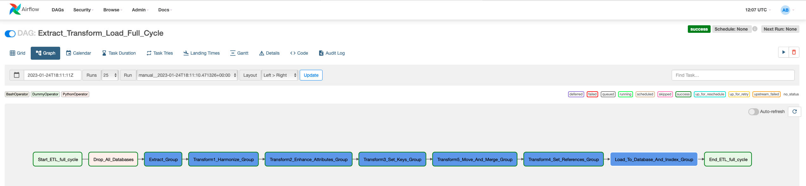
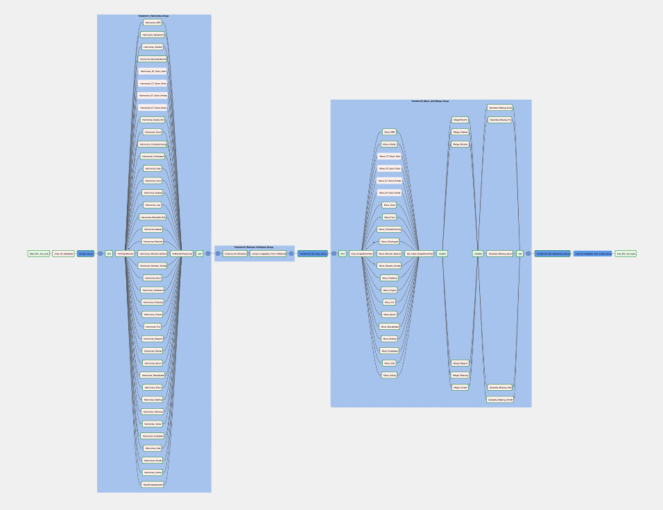

# Wasstraat Archeologische Data

Uitleggen wat het isWasstraat Archeologische Data

Uitleggen Mongo Elastic

## Resultaat

## Verwerken archeologische data

Het verwerken van alle archeologische data gebeurt doordat in een aantal stappen de data wordt ingelezen, gewassen en samengevoegd. Deze stappen zijn uitgewerkt in procesmodellen in [Apache Airflow](https://airflow.apache.org): een opensource workflow engine. Het hoofdproces van de Wasstraat Archeologische Data kent de volgende hoofdstappen (zie onderstaanbe afbeelding).

Het hoofdproces voor het verwerken van de archeologische data kent de volgende hoofdstappen:

1. Drop All Databases: schoon alle data zodat gestart kan worden met verse databases;
2. Extract: lees alle data uit externe bronnen in. De data wordt 'as-is' ingelezen, dus zonder enige transformatie. Hier kunnen vele ongelijkvormige databases worden ingelezen. Voor [Archeologie Delft](https://archeologie-delft.nl) zijn dat ongeveer 1000 databases, een kleine 100.000 foto's en andere afbeeldingen en enkele 1000'den rapporten. In totaal een klein [terabyte](https://nl.wikipedia.org/wiki/Terabyte) aan data;
3. Transform1 Harmonize: in deze stap worden de veldnamen van alle ingelezen data geharmoniseerd. Van alle gegevens, uit welke bron dan ook, worden de entiteitnamen en veldnamen gelijkgetrokken;   
4. Transform2 Enhance Alle Attributes: hier wordt de inhoud van alle velden consistent gemaakt. In deze stap worden alle gegevens inhoudelijk 'gewassen'. Alle velden krijgen het juiste formaat. Als voorbeeld: datumvelden worden op één manier geschreven, jaartallen worden eenduidig gemaakt (in de bron staat het soms in tekst, getallen, romeinse notatie, soms tijdvakken etc.), projectcodes worden overal op dezelfde manier gehanteerd, en zo verder. Ook worden in deze stap de metagegevens uit alle aangeboden mediamateriaal gehaald;
5. Transform3 Setkeys: in deze stap krijgen alle ingelezen entiteiten een eigen unieke sleutel, en krijgen de entiteiten verwijzende sleutels naar andere entiteiten. Sleutels zijn nodig om entiteiten uniek te identificeren en zijn ook nodig om verwijzingen tussen entiteiten te maken, zoals een verwijzing vanuit een Artefact naar het Project waarbinnen deze valt. De bronbestanden bevatten niet allemaal de juiste sleutels of informatie om te koppelen naar andere entiteiten. Om deze reden worden op basis van de in de eerdere stappen geschoonde informatie nieuwe eenduidige en herkenbare sleutelvelden gemaakt;
6.  Transform4 Move and Merge: in de data zoals die nu is ontstaan kunnen nog dubbelingen voorkomen, zo kan een bepaald Artefact meerdere keren voorkomen (vaak aangeboden in meerdere bronbestanden), soms worden enteiten in meerdere bronnen beschreven. In deze stap worden op basis van de aangemaakte sleutels dubbele voorkomens van entiteiten samengevoegd. Ook de verschillende soorten Artefacten en Bestanden worden met behoud van [polymorfisme](https://nl.wikipedia.org/wiki/Polymorfisme_(informatica)) samengevoegd. Artefacten en Bestanden kunnen zo verschillende soorten hebben, met eigen unieke atributen, en toch als Artefact en Bestand herkenbaar zijn. De zo onstane informatie wordt naar een nieuwe Mongo-database geschreven waar alleen unieke entiteiten in voorkomen.
7. Transform5 Set References: Op basis van de eerder aangemaakte (nu unieke) sleutels krijgen alle entiteiten een primaire sleutel in de vorm van een [Integer](https://nl.wikipedia.org/wiki/Integer_(informatica)) (die te gebruiken is in een [relationele database](https://nl.wikipedia.org/wiki/Relationele_database) en nodig is voor de volgende stap);
8. Load to Database en index: in deze laatst database wordt de data van de Mongo-database naar de Postgres-database gekopïeerd. Ook worden de indexes aangemaakt in Elastic Search voor het fulltext kunnen zoeken.  

In het hoofdproces worden vele soorten gegevens ingelezen, de verwerking hiervan is te zien in het deels uitgeklapte procesmodel (niet goed leesbaar, maar voor het idee).

## Soorten archeologische data

De Wasstraat Archeologische data  

## Installatie

## Snel starten 
