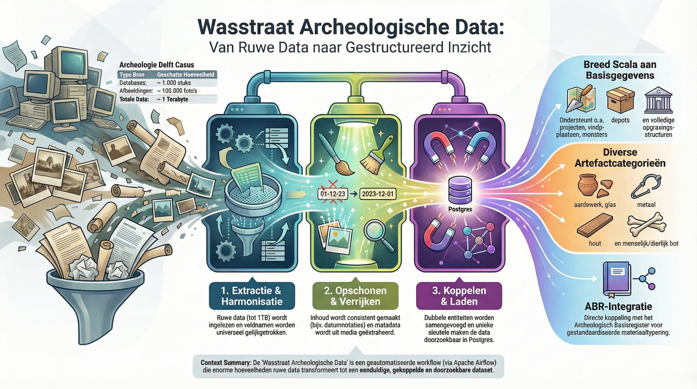
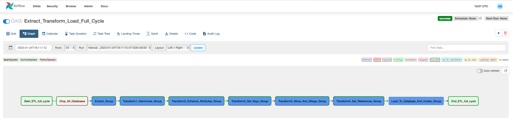
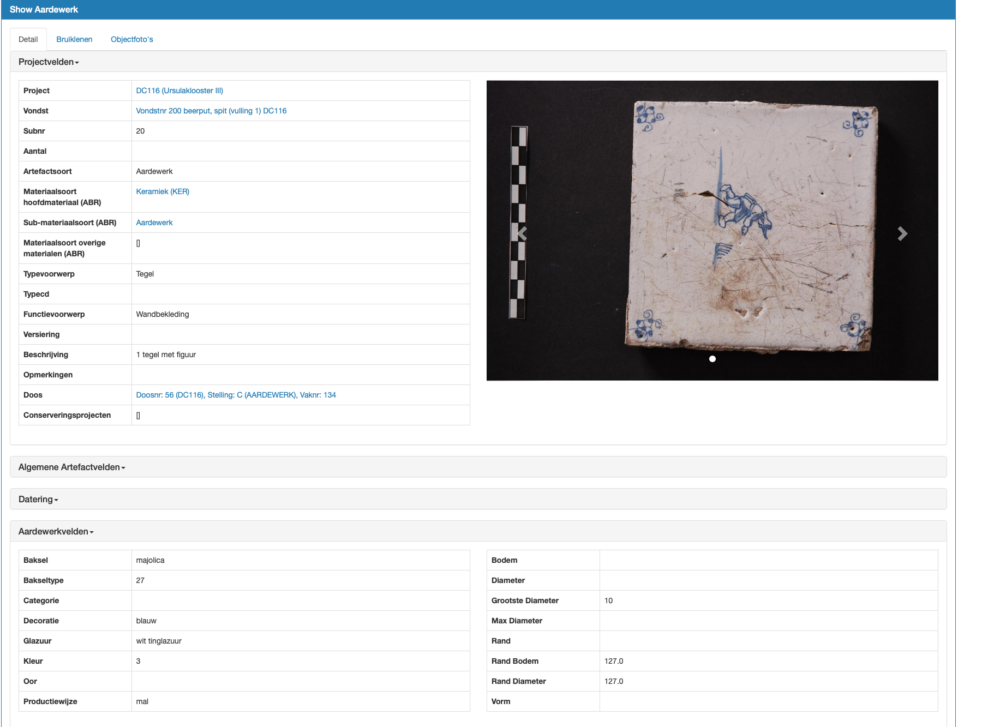
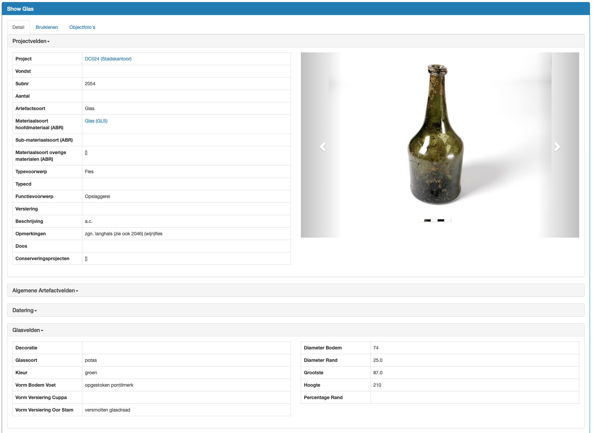

# Wasstraat Archeologische Data

[](https://joinup.ec.europa.eu/collection/eupl/eupl-text-eupl-12)
[](https://github.com/brienen/wasstraat_archeologische_data/releases)
[](https://www.python.org/)
[](https://docs.docker.com/compose/)

> Een open-source platform dat archeologische gegevens verzamelt, verwerkt en toegankelijk maakt — van ruwe data naar gestructureerd inzicht.

[](image/wasstraat-overzicht.jpeg)

## Over het project

De Wasstraat functioneert als een digitale wasstraat voor archeologische data. Verspreide bronbestanden — Access-databases, Excel-sheets, foto's, rapporten en GIS-bestanden — worden geautomatiseerd ingelezen, opgeschoond, gekoppeld en gestructureerd opgeslagen.

Ontwikkeld voor de **gemeente Delft**, waar meer dan 1.000 opgravingen met tienduizenden foto's, vondstlijsten en rapporten (bijna 1 Terabyte aan data) zijn gedigitaliseerd.

## Documentatie 

Zie de [volledige documentatie](https://brienen.github.io/wasstraat_archeologische_data/) voor het uitgeklapte procesmodel en gedetailleerde uitleg per stap.

## Architectuur

Het platform bestaat uit twee hoofdapplicaties die als Docker-containers draaien:

| Applicatie | Doel | Poort |
|------------|------|-------|
| **Airflow** (`airflow_app/`) | Data verwerken (ETL-pipeline) | :8080 |
| **Flask App** (`app/`) | Data inzichtelijk maken (web-interface) | :5051 |

Daarnaast draaien de volgende ondersteunende services:

| Service | Rol | Poort |
|---------|-----|-------|
| **PostgreSQL** | Definitieve relationele opslag | :5432 |
| **MongoDB** | Ruwe opslag en staging | :27017 |
| **Elasticsearch** | Fulltext-zoekindex | :9200 |
| **Redis** | Caching | :6379 |
| **Apache** | Statische bestanden (foto's) | :5052 |
| **Jupyter** | Data-analyse notebooks | :8888 |

## Verwerken van archeologische data

Het verwerken van alle archeologische data is uitgewerkt in procesmodellen in [Apache Airflow](https://airflow.apache.org). Het hoofdproces kent de volgende stappen:

[](image/Airflow_Hoofdprocessen.png)

1. **Drop All Databases** — Schoon alle data zodat gestart kan worden met verse databases.
2. **Extract** — Lees alle data uit externe bronnen in, as-is zonder transformatie. Voor Archeologie Delft zijn dat ongeveer 1.000 databases, ~100.000 foto's en enkele duizenden rapporten — in totaal bijna 1 TB aan data.
3. **Transform1 Harmonize** — Harmoniseer de veldnamen van alle ingelezen data over alle bronnen heen.
4. **Transform2 Enhance Attributes** — Maak de inhoud van alle velden consistent. Datumformaten, codes, projectnummers en metadata worden genormaliseerd.
5. **Transform3 Set Keys** — Genereer unieke sleutels en verwijzende sleutels voor alle entiteiten.
6. **Transform4 Move and Merge** — Voeg dubbele entiteiten samen met behoud van [polymorfisme](https://nl.wikipedia.org/wiki/Polymorfisme_(informatica)). Artefacten en Bestanden kunnen zo verschillende soorten hebben met eigen attributen.
7. **Transform5 Set References** — Ken integer-sleutels toe voor gebruik in de relationele database.
8. **Load to Database & Index** — Kopieer data naar PostgreSQL en bouw de Elasticsearch-zoekindex op.

## Ondersteunde data

| Categorie | Entiteiten |
|-----------|-----------|
| **Basisgegevens** | Project, Vindplaats, Vondst, Put, Vlak, Spoor, Vulling, Artefact, Monster, Bestand |
| **Depotgegevens** | Stelling, Standplaats, Plaatsing, Doos |
| **Bestanden** | Foto's, Tekeningen, Rapporten — elk met automatische metadata-extractie |
| **Artefacten** | Aardewerk, Glas, Metaal, Hout, Steen, Leer, Dierlijk Bot, Menselijk Bot, Kleipijp, Bouwaardewerk, Munt, Schelp, Textiel |
| **Standaarden** | [ABR](https://thesaurus.cultureelerfgoed.nl/search;schemes=abr:b6df7840-67bf-48bd-aa56-7ee39435d2ed), GGM, CIDOC CRM, DANS e-Depot, Archis |

Elke artefactcategorie kent eigen specifieke velden:

| | |
|---|---|
| [](image/Attributen_Aardewerk.png) | [](image/Attributen_Glas.png) |

## Snel starten

### Vereisten

- [Docker](https://www.docker.com/) en Docker Compose
- [GNU Make](https://www.gnu.org/software/make/) (standaard aanwezig op macOS en Linux)
- Minimaal 8 GB RAM beschikbaar voor Docker

### Installatie

```bash
# Clone de repository
git clone https://github.com/brienen/wasstraat_archeologische_data.git
cd wasstraat_archeologische_data

# Start de wasstraat
# (config/*.env bestanden worden automatisch gegenereerd met unieke wachtwoorden)
make app
```

> **Tip:** Bij de eerste start genereert `init-config.sh` automatisch alle `config/*.env` bestanden met unieke wachtwoorden. Om handmatig opnieuw te genereren: `./init-config.sh --force`

Typ `make help` voor een overzicht van alle beschikbare commando's.

### Omgevingen starten

```bash
make dev          # Ontwikkelomgeving (met hot-reload volumes)
make app          # Lokale modus (alle services)
make acc          # Acceptatieomgeving
make prod         # Productie (gepubliceerde images)
make stop         # Stop alle containers
make start        # Herstart gestopte containers
make logs         # Toon live logs
make ps           # Toon status van alle services
```

### Eerste data verwerken

1. Plaats bronbestanden (`.mdb`) in `data/input/basefiles/projectdatabase/digidepot/`
2. Open Airflow UI op [http://localhost:8080](http://localhost:8080)
3. Start de DAG **`Extract_Transform_Load_Full_Cycle`**
4. Bekijk het resultaat in de Flask App op [http://localhost:5051](http://localhost:5051)

### Backup en restore

```bash
make backup                              # Backup PostgreSQL + MongoDB
make restore TS=2024-03-15_14-30-00      # Restore vanuit timestamp
make export                              # Exporteer alle tabellen als CSV
```

### Testen

```bash
make install      # Eenmalig: maakt .venv aan met test-dependencies
make test         # Draai unit tests
make integration  # Draai integratietests (start/stopt Docker automatisch)
make test-all     # Unit + integratietests
```

## Projectstructuur

```
wasstraat_archeologische_data/
├── airflow_app/          # Airflow ETL-applicatie
│   ├── dags/             # DAG-definities en transformatielogica
│   └── scripts/          # Shell-scripts voor data-import
├── app/                  # Flask web-applicatie
│   └── app/              # Models, views, API, templates
├── shared/               # Gedeelde modules (config, database, constanten)
├── config/               # Environment-bestanden (.env)
├── services/             # Dockerfiles per service
├── data/                 # Input- en outputdata
│   └── input/basefiles/  # Bronbestanden
├── tests/                # Unit- en integratietests
├── notebooks/            # Jupyter notebooks voor analyse
├── docs/                 # MkDocs documentatie
├── image/                # Afbeeldingen voor README
├── Makefile              # Alle commando's (make help)
├── docker-compose.yml    # Basis service-definities
├── docker-compose.test.yml     # Lichtgewicht test-databases
├── docker-compose.develop.yml  # Development overrides
├── docker-compose.acc.yml      # Acceptatie overrides
└── docker-compose.prod.yml     # Productie overrides
```

## Documentatie

De volledige technische documentatie is beschikbaar als [MkDocs-site](https://brienen.github.io/wasstraat_archeologische_data/):

```bash
make docs       # Start MkDocs dev-server op localhost:8000
make docs-build # Bouw statische site
```

De documentatie bevat:

- **Projectoverzicht** — Inleiding, probleemstelling en doelstellingen
- **Aan de slag** — Stap-voor-stap handleiding voor eerste gebruik
- **Architectuur** — Systeemarchitectuur, dataflow, componentenmodel, gegevensmodel en stack
- **Componenten** — Extractie, SingleStore, Transformatie, Crossviews, Validatie, Configuratie, Zoeken
- **Deployment** — Omgevingen, Airflow vs. App, proefdata inlezen
- **Testen** — Unit tests, integratietests en testinfrastructuur
- **Diagrammen** — draw.io architectuurdiagrammen

## Technische stack

| Categorie | Technologieën |
|-----------|---------------|
| **Orchestratie** | Apache Airflow 2.3.3 |
| **Backend** | Python, Flask, Flask-AppBuilder |
| **Databases** | MongoDB 4.2, PostgreSQL, Elasticsearch 8.6 |
| **Caching** | Redis |
| **Infrastructuur** | Docker Compose |
| **Analyse** | Jupyter Lab, Pandas, GeoPandas |
| **Data-import** | mdbtools, Pillow, pdf2image |

## Bijdragen

Bijdragen zijn welkom! Het project is open-source onder de EUPL-licentie.

1. Fork de repository
2. Maak een feature-branch (`git checkout -b feature/mijn-verbetering`)
3. Commit je wijzigingen (`git commit -m 'Voeg verbetering toe'`)
4. Push naar de branch (`git push origin feature/mijn-verbetering`)
5. Open een Pull Request

Bij vragen of suggesties, open een [issue](https://github.com/brienen/wasstraat_archeologische_data/issues).

## Licentie

Dit project is uitgegeven onder de [EUPL-1.2 licentie](https://joinup.ec.europa.eu/collection/eupl/eupl-text-eupl-12).

## Contact

Ontwikkeld door **E-Space** (Arjen Brienen) in opdracht van de gemeente Delft.
Het project wordt uitgebreid tot een generiek systeem voor andere Nederlandse gemeenten via Stichting Reuvens.
