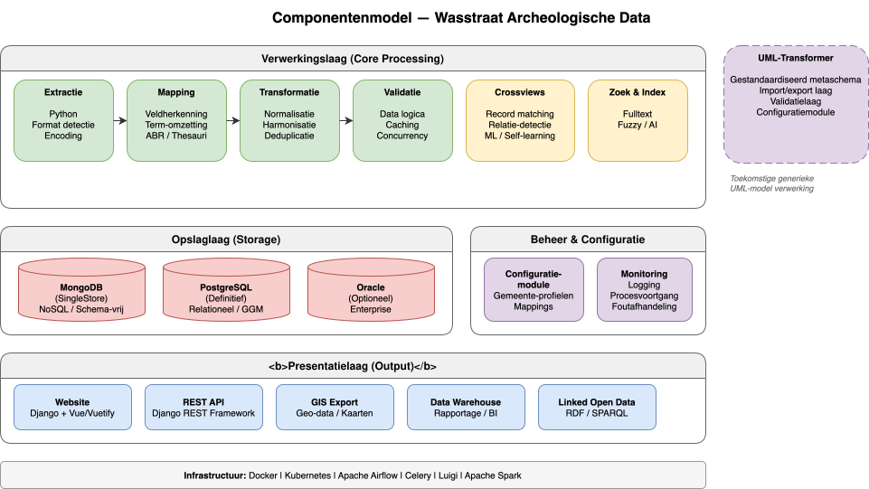

# Componentenmodel

## Overzicht

Dit document beschrijft hoe de verschillende modules en services van het Wasstraat-systeem samenwerken. Het componentenmodel toont de relaties en afhankelijkheden tussen technische en functionele eenheden.



## Kerncomponenten

### Extractie Module
**Verantwoordelijkheid**: Conversie van brondataformaten naar gestandaardiseerde formaten.

**Ondersteund door**:
- Python extractie-scripts
- Mapping-engine voor term/veld-herkenning
- Validatieroutines

**Gegevensuitgang**: Ruw format naar MongoDB/SingleStore

### Transformatie Module
**Verantwoordelijkheid**: Normalisering en harmonisering van gegevens.

**Kernfuncties**:
- ABR-harmonisering (thesaurus-afstemming)
- Datumformatstandardisatie
- Locatie-deduplicatie
- Spellingstandardisatie

**Gegevensuitgang**: Genormaliseerde records naar PostgreSQL/Oracle

### Handmatige Schoonmaakinterface
**Verantwoordelijkheid**: Menselijke validatie en correctie van kritieke gegevenselementen.

**Specifieke Taken**:
- Controle van waardeconflicten
- Aanpassing van foutieve mappings
- Disambiguering van ambigue gegevens

**Gegevensinteractie**: Directe updates in PostgreSQL/Oracle met audit logging

### Clientonderhoudinterface
**Verantwoordelijkheid**: Beheer van systeemconfiguratie en metadata.

**Specifieke Taken**:
- Bronconfiguratie
- Gebruiker- en permissiebeheer
- Mapping-sjablonen beheren
- Validatieregel-management

**Gegevensinteractie**: Configuratietabellen in PostgreSQL/Oracle

### Data Warehouse / Reporting
**Verantwoordelijkheid**: Analytische weergaven en rapportage van historische data.

**Ondersteund door**:
- Snowflake gegevens-consolidering
- Apache Spark voor ETL
- RShiny voor interactieve dashboards
- Jupyter voor ad-hoc analyses

**Gegevensingang**: Read-only kopieën uit definitieve opslag

### Website & API's
**Verantwoordelijkheid**: Publieke toegang tot archeologische gegevens.

**Functies**:
- REST API's voor gegevenstoegang
- Web UI zoeken/browse
- Linked Open Data exports
- Fulltext search

**Gegevensingang**: PostgreSQL/Oracle via SQLAlchemy ORM

### GIS-Systeem
**Verantwoordelijkheid**: Geografische visualisatie en spatiale analyses.

**Functies**:
- WMS/WFS geo-services
- GeoJSON exports
- Kaartgebaseerde interfaces
- Spatiale queries

**Gegevensingang**: PostGIS-extensie van PostgreSQL

## Ondersteunende Systemen

### Extractie & Transformatie
| Component | Functie |
|-----------|---------|
| **Python Pandas** | Data wrangling en transformatie |
| **RDFLib** | RDF-processing voor semantische mapping |
| **SQLAlchemy** | ORM voor database-agnostische query's |
| **Alembic** | Database schema versioning & migraties |

### Data Access & Semantiek
| Component | Functie |
|-----------|---------|
| **Jinja2** | Template-engine voor dynamische queries |
| **Fulltext Search Engine** | Polymorfe, vakgebied-bewuste zoek-indexering |
| **Crossviews** | Cross-source querying zonder duplicatie |

### Web Framework
| Component | Functie |
|-----------|---------|
| **Django** | Backend web framework |
| **Vue/Vuetify** | Frontend JavaScript framework |
| **REST Framework** | API architecture |

### Storing
| Component | Functie |
|-----------|---------|
| **MongoDB** | NoSQL opslag voor ruw data |
| **SingleStore** | Kolom-opslag voor analytische queries |
| **PostgreSQL** | Relationele database (voorkeur) |
| **Oracle** | Relationele database (legacy) |

### Orchestratie
| Component | Functie |
|-----------|---------|
| **Airflow** | Workflow orchestratie en scheduling |
| **Luigi** | Task dependency management |
| **Celery** | Asynchrone taakuitvoering |

### Infrastructure
| Component | Functie |
|-----------|---------|
| **Docker** | Container-verpakking |
| **Kubernetes** | Container orchestratie & deployment |

### Analyse & Visualisatie
| Component | Functie |
|-----------|---------|
| **Apache Spark** | Distributed ETL processing |
| **RShiny** | Interactieve dashboards |
| **Jupyter** | Notebook-gebaseerde analyses |

## UML-Transformer Project (2024)

Een specialist-component voor generieke transformatie van UML-gemodelleerde datamodellen:

### Onderdelen
- **Metaschema Repository**: Opslag van UML-modellen in kanonieke vorm
- **Import/Export Laag**: Conversie tussen UML-formaten en interne representatie
- **Validatie Laag**: Schema-validatie tegen UML-definities
- **Configuratie Module**: Mapping van UML naar fysieke databaseschema's

### Integratie
De UML-Transformer ondersteunt cross-model mapping:
- CIDOC CRM ↔ Lokale gegevensmodellen
- CRMarchaeo ↔ Project-specifieke modellen
- CRMsci ↔ Laboratorium-gemodelleerde data
- GGM (Gemeentelijk Gegevensmodel) ↔ Administratieve data

## Informatiestroom tussen Componenten

```
Bronsystemen
    ↓ (Extractie Module)
MongoDB/SingleStore (Ruw)
    ↓ (Transformatie Module)
PostgreSQL/Oracle (Definitief)
    ↙ ↓ ↘
  /   |   \
GIS  Web  Data
    Warehouse

Handmatige Schoonmaak ⟷ PostgreSQL/Oracle
Clientonderhoud ⟷ Configuratietabellen
```

## Betrouwbaarheid & Redundantie

De componentenarchitectuur ondersteunt:
- **Separatie van concerns**: Componenten hebben duidelijk omgrensd verantwoordelijkheden
- **Decomponeerbaarheid**: Componenten kunnen onafhankelijk getest en geüpdatet worden
- **Redundantie**: Kritieke componenten kunnen gerepliceerd worden in Kubernetes
- **Failover**: Omleiding naar backup-systemen bij uitval
