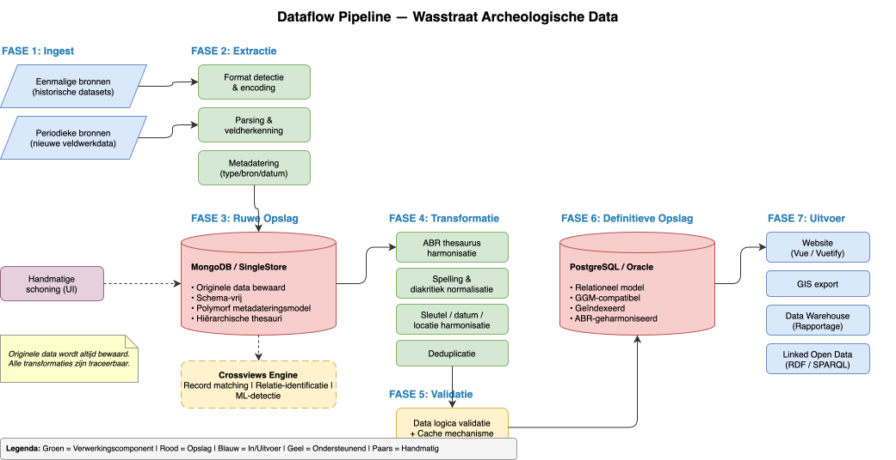

# Gegevensstroomverloop

## Overzicht

Dit document beschrijft de volledige stroom van archeologische gegevens door het Wasstraat-systeem, van bron tot eindgebruiker. Elke fase voegt waarde toe door gegevens incrementeel beter toegankelijk, betrouwbaar en betekenisvol te maken.



## Fase 1: Bronsystemen

Gegevens origineren uit verschillende bronnen:

| Brontype | Beschrijving | Frequentie |
|----------|-------------|-----------|
| Historische datasets | Gedigitaliseerde collecties, archieven | Eenmalig |
| Veldwerkapplicaties | Real-time veldopnamen van opgravingen | Periodiek |
| Externe bronnen | Samenwerking met andere instellingen | Variabel |
| Thesauribronnen | Gecontroleerde vocabulaires (ABR, etc.) | Regelmatig |

## Fase 2: Extractie

**Python-extractielaag** leest gegevens in native formaten en converteert naar standaardformaten.

### Extractielogica
```python
# Pseudo-code voor typische extractiestap
for bronbestand in bronsystemen:
    data = lees_bronformaat(bronbestand)
    validatie = basale_checks(data)
    standaard = map_naar_standaardformaat(data)
    log_extractie(bronbestand, standaard, validatie)
```

### Mapping en Herkenning
De **mappinglaag** herkent:
- **Termdefinities**: Mapping van bron-termen naar gestandaardiseerde vocabulaires
- **Veldherkenning**: Automatische detectie van semantisch equivalente velden
- **Domeinafleiding**: Bepaling van gegevensdomeinen op basis van inhoud

## Fase 3: Ruwopslag

Opgeslagen gegevens in niet-genormaliseerde vorm:

### MongoDB NoSQL Storage
Flexibele schema voor heterogene bronnen:
- Behoud van originele structuur
- Semi-gestructureerde gegevens
- Schaalbare horizontale distributie

### SingleStore Kolom-opslag
Geoptimaliseerd voor analytische queries:
- Efficiënte compressie
- Snelle aggregaties
- Ondersteuning voor crossviews

## Fase 4: Transformatie

De **Python-transformatielaag** en **SQLAlchemy ORM** normaliseren en harmoniseren gegevens:

### ABR-Harmonisering
Mapping van lokale termen naar ABR-thesaurusconcepten:
```
Lokale term: "middeleeuwse aardewerkscherf"
    ↓ [ABR-mapping]
ABR-concept: "keramiek" (urn:nbn:nl:ui:nbn-id-123456)
```

### Datumafstemming
Conversie naar ISO 8601-standaard:
```
Verschillende invoeren: "13de eeuw", "1200-1300", "AD 1250"
    ↓ [Normalisering]
Standaard: {"begin": 1200, "einde": 1300}
```

### Locatieharmonisering
Consolidatie van locatieaanduidingen:
```
Duplicate locaties → Deduplicatie → Canonische locatie-ID
RDx,y koordinaten → Conversie naar WGS84
```

### Spelling en Tekst
- Unicode-normalisatie
- Diacrietenafhandeling
- Diakritiek-neutrale zoekindex

## Fase 5: Definitieve Opslag

Genormaliseerde, canonieke opslag in relationele databases:

### PostgreSQL
Voorkeur voor nieuwe implementaties:
- Open-source, goed gedocumenteerd
- Sterke JSON/jsonb-ondersteuning
- PostGIS extensie voor geografische data
- Excellent voor FAIR data-workflows

### Oracle
Voor legacy-integratie en enterprise-omgevingen:
- Reeds aanwezig in sommige organisaties
- Sterke integratie met BI-tools

## Fase 6: Verdere Verwerking

### Fulltext Search
Polymorfe zoekindexering met:
- Vakgericht-bewuste tokening
- Multi-language stemming
- Relevantie-ranking op basis van gegevensveld

### Crossviews
Query-lagen die data uit meerdere bronnen combineren zonder duplicatie

## Fase 7: Outputs

### Website
- REST API's
- Web UI voor zoeken en browse
- Linked Open Data exports

### GIS-Integratie
- WMS/WFS services
- GeoJSON exports
- Kaartgebaseerde interfaces

### Data Warehouse
- OLAP-cubes
- Reporting dashboards
- Exports voor verdere analyse

## Transformatiestelling

Een kritiek ontwerp-principe:

> **Originele data wordt altijd behouden. Transformaties kunnen opnieuw worden uitgevoerd.**

Dit betekent:
- Alle transformatielogica is versioneerd
- Transformatieresultaten kunnen worden geverifieerd
- Fouten kunnen worden geïsoleerd en gecorrigeerd
- Volledig audittrail is beschikbaar

## Handmatige Interventie

De **handmatige schoonmaakinterface** biedt menselijke mogelijkheden:
- Controle van onzekere transformaties
- Correctie van foutieve mappings
- Disambiguering van anomalieën

Dit is vooral belangrijk voor:
- Waardeconflicten tussen bronnen
- Verouderde of onvolledig bron-thesaurus
- Contextgebonden interpretaties
