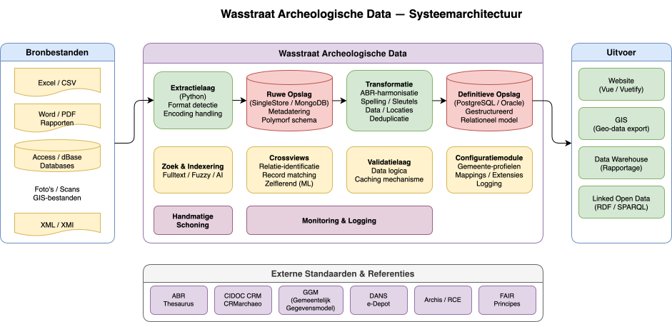

# Systeemarchitectuur

## Overzicht

Het Wasstraat Archeologische Data-systeem is een geïntegreerde gegevensplatform dat archeologische informatie uit meerdere bronnen verzamelt, transformeert en beschikbaar stelt via diverse outputs. Het systeem volgt een data pipeline-benadering met strikte scheiding van concerns tussen extractie, opslag, transformatie en uitgave.

## Kernarchitectuur

Het systeem is opgebouwd uit de volgende lagen:

### 1. Bronnen (Sources)
- **Eenmalige imports**: Historische gegevenssets
- **Periodieke bronnen**: Continu of regelmatig bijgewerkte gegevens

### 2. Extractielaag (Extraction)
Converteert diverse gegevensbronnen naar een gestandaardiseerd formaat. De extractielaag:
- Leest data uit heterogene bronnen
- Voert basale validatie uit
- Behoudt alle originele informatie

### 3. Opslag - Ruw (Raw Storage)
Opslag van onbewerkte data direct na extractie:
- **MongoDB**: NoSQL opslag voor semi-gestructureerde data
- **SingleStore**: Kolom-georiënteerde opslag voor queryperformance

Originele gegevens worden altijd bewaard zonder aanpassingen.

### 4. Transformatielaag (Transformation)
Normaliseert en harmoniseert de opgeslagen data:
- **ABR-harmonisering**: Afstemming met het ABR-thesaurus
- **Spelling**: Gestandaardiseerde schrijfwijzen
- **Sleutel/Datum/Locatie harmonisering**: Consolidatie van redundante en inconsistente gegevens

### 5. Opslag - Definitief (Definitive Storage)
Eindopslag in gestructureerde relationele databases:
- **PostgreSQL**: Open-source relationele database
- **Oracle**: Enterprise-grade relationele database

### 6. Outputs
Diverse gebruikersfacing applicaties:
- **Website**: Webinterface voor publieke toegang
- **GIS**: Geografische informatie-systemen
- **Data Warehouse/Reporting**: Analytische dashboards en rapportage

## Ondersteunende Componenten

### Handmatige Schoonmaakinterface
Interface voor menselijke validatie en correctie van gegevens, op kritieke punten in de pipeline.

### Clientonderhoudinterface
Beheersmodule voor het beheren van bronconfiguraties, gebruikers en systeeminstellingen.

## Gegevenspreservatie

Een kernprincipe van het systeem is dat **originele gegevens altijd behouden blijven**. Dit maakt het mogelijk om:
- Transformaties op elk moment opnieuw uit te voeren
- Fouten in transformatie-logica op te sporen en te corrigeren
- Audit trails in stand te houden
- Terugkeer naar bron-integriteit te garanderen

## Data Governance

Het systeem implementeert strakke gegevensbeheer:
- Strikte scheiding tussen ruw en gereinigd
- Versionering van transformatielogica
- Volledig traceerbare transformatiegeschiedenis
- Geïsoleerde correctiebewerkingen in de handmatige schoonmaakinterface
