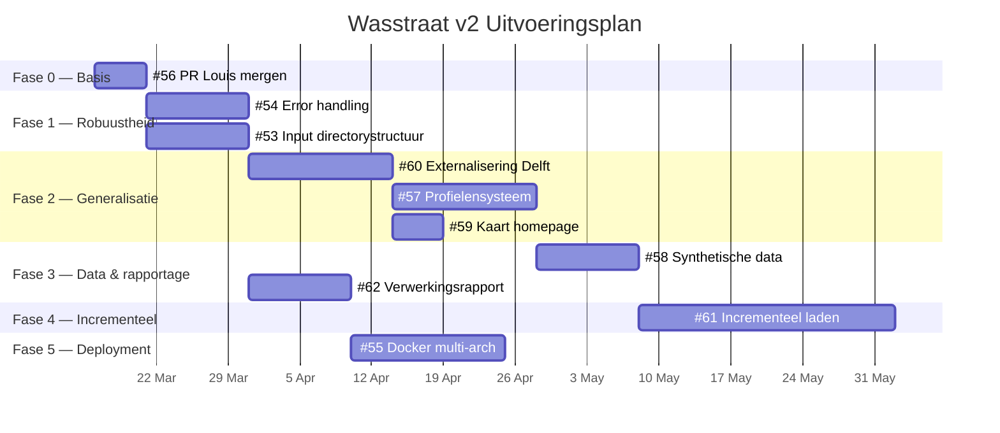
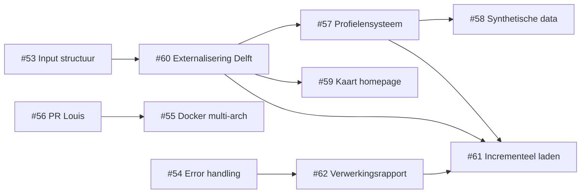

# Wasstraat v2 — Uitvoeringsplan

## Overzicht

10 actieve issues, ~13 weken, ~35-55 commits.

## Fase 0 — Basis (week 1)

> [!tip] Doel
> Schone basis creëren door bestaand werk te integreren.

| Issue | Omschrijving | Commits |
| ----- | ------------ | ------- |
| [#56](https://github.com/brienen/wasstraat_archeologische_data/issues/56) | PR Louis mergen | 1 |

**Acties:**
- Review PR #50 (aandachtspunt: `arch=amd64` is hardcoded, fix in #55)
- Merge naar main

---

## Fase 1 — Pipeline robuuster (week 1-3)

> [!tip] Doel
> Error handling en inputstructuur verbeteren als fundament voor de generalisatie.

| Issue | Omschrijving | Afhankelijkheid | Commits |
| ----- | ------------ | --------------- | ------- |
| [#54](https://github.com/brienen/wasstraat_archeologische_data/issues/54) | Error handling verbeteren | Geen | 3-5 |
| [#53](https://github.com/brienen/wasstraat_archeologische_data/issues/53) | Algemene input directorystructuur | Geen | 2-3 |

> [!note] #54 en #53 zijn onafhankelijk en kunnen parallel.

---

## Fase 2 — Generalisatie (week 3-6)

> [!warning] Kritiek pad
> Dit is de risicovolste fase. Draai `make test` na elke commit.

| Issue | Omschrijving | Afhankelijkheid | Commits |
| ----- | ------------ | --------------- | ------- |
| [#60](https://github.com/brienen/wasstraat_archeologische_data/issues/60) | Externalisering Delft-logica | Na #53 | 5-8 |
| [#57](https://github.com/brienen/wasstraat_archeologische_data/issues/57) | Profielensysteem sleutelpatronen | Na #60 | 5-8 |
| [#59](https://github.com/brienen/wasstraat_archeologische_data/issues/59) | Kaart homepage generaliseren | Na #60 | 1-2 |

**Volgorde:** #60 → #57 (strikt sequentieel). #59 kan parallel aan #57.

---

## Fase 3 — Data en rapportage (week 6-8)

> [!tip] Doel
> Synthetische data als proof of concept voor de generalisatie. Verwerkingsrapport als basis voor incrementeel laden.

| Issue | Omschrijving | Afhankelijkheid | Commits |
| ----- | ------------ | --------------- | ------- |
| [#58](https://github.com/brienen/wasstraat_archeologische_data/issues/58) | Synthetische voorbeelddata | Na #57 | 3-5 |
| [#62](https://github.com/brienen/wasstraat_archeologische_data/issues/62) | Verwerkingsrapport | Na #54 | 3-5 |

> [!note] #62 kan al starten zodra #54 af is — eventueel parallel aan fase 2.

---

## Fase 4 — Incrementeel laden (week 8-13)

> [!warning] Grootste klus
> Splits in sub-issues: bestandshash-registratie, merge-herontwerp, PostgreSQL upsert, Elasticsearch delta-index.

| Issue | Omschrijving | Afhankelijkheid | Commits |
| ----- | ------------ | --------------- | ------- |
| [#61](https://github.com/brienen/wasstraat_archeologische_data/issues/61) | Incrementeel laden | Na #57, #60, #62 | 10-15 |

---

## Fase 5 — Deployment (week 8-11, parallel aan fase 4)

| Issue | Omschrijving | Afhankelijkheid | Commits |
| ----- | ------------ | --------------- | ------- |
| [#55](https://github.com/brienen/wasstraat_archeologische_data/issues/55) | Docker multi-arch + productie | Na #56 | 3-5 |

---

## Afhankelijkheden

---

## Geparkeerde issues

> [!info] Voorlopig niet oppakken

| Issue | Titel | Reden |
| ----- | ----- | ----- |
| [#8](https://github.com/brienen/wasstraat_archeologische_data/issues/8) | Automatisch backup | Voorlopig niet |
| [#10](https://github.com/brienen/wasstraat_archeologische_data/issues/10) | Testscripts | Voorlopig niet |
| [#11](https://github.com/brienen/wasstraat_archeologische_data/issues/11) | Env → secrets | Uitgesteld |
| [#48](https://github.com/brienen/wasstraat_archeologische_data/issues/48) | Typen opgraving | Voorlopig niet |
| [#49](https://github.com/brienen/wasstraat_archeologische_data/issues/49) | Fulltext zoeken filename | Voorlopig niet |
| #27, #34, #33, #5, #13, #36, #6, #3, #17 | Flask-gerelateerd | Flask uitgesloten |

---

## Te sluiten issues

> [!todo] Sluiten met verwijzing naar nieuwe issues

| Issue | Titel | Verwijzing |
| ----- | ----- | ---------- |
| [#15](https://github.com/brienen/wasstraat_archeologische_data/issues/15) | Versies van Records bijhouden | → #61 |
| [#16](https://github.com/brienen/wasstraat_archeologische_data/issues/16) | Kwaliteitsattribuut voor alle records | → #62 |
| [#22](https://github.com/brienen/wasstraat_archeologische_data/issues/22) | Projecten niet in DelfIT | → #60, #57 |
| [#26](https://github.com/brienen/wasstraat_archeologische_data/issues/26) | DC160 inleesprobleem | → #54, #62 |
| [#35](https://github.com/brienen/wasstraat_archeologische_data/issues/35) | Projecten zonder database | → #54, #62 |
| [#37](https://github.com/brienen/wasstraat_archeologische_data/issues/37) | Search met voorbeeldgegevens | → #58 |
| [#40](https://github.com/brienen/wasstraat_archeologische_data/issues/40) | Objectfoto's koppeling onbekend | → #62 |
| [#46](https://github.com/brienen/wasstraat_archeologische_data/issues/46) | Metaalvelden | → #60 |
| [#47](https://github.com/brienen/wasstraat_archeologische_data/issues/47) | Punten Marloes | Stale |
